# lean-ai-sdd-pipeline

A lean, practical **Spec-Driven Development pipeline** for Claude Code — Claude skills that take a project from initialization through feature specification to a fully-specified implementation plan, plus an issue-tracking workflow for defects, drift, and change requests.

It is intentionally **not** an enterprise ALM platform. The guiding principle:

> Provide the minimum amount of structure necessary to consistently produce high-quality software.

**How it works, in one paragraph:** Claude runs the skills below to take a project from initialization through feature specification (brief → technical design → API spec → tests → implementation plan) to implementation, and to track issues (defects, drift, change requests) through investigation, resolution, and verification. Claude does the drafting — every document, every classification, every consistency check. You do the reviewing — nothing proceeds past a review gate until you confirm a document, and code is never committed or pushed without you. For the full walkthrough, see [`docs/pipeline-overview.md`](docs/pipeline-overview.md).

```mermaid
flowchart TD
    classDef userSkill fill:#cfe2ff,stroke:#2b6cb0,color:#1a365d,stroke-width:1px
    classDef systemSkill fill:#ffe8cc,stroke:#c05621,color:#652b06,stroke-width:1px,stroke-dasharray: 3 2
    classDef doc fill:#e6f4ea,stroke:#2f855a,color:#22543d,stroke-width:1px
    classDef gate fill:#fff0f0,stroke:#c53030,color:#742a2a,stroke-width:1px
    classDef impl fill:#edf2f7,stroke:#4a5568,color:#1a202c,stroke-width:1px
    classDef structure fill:#f5f5f5,stroke:#718096,color:#2d3748,stroke-width:1px

    subgraph LEGEND[Legend]
        direction LR
        L1[User-facing skill]:::userSkill
        L2[Internal system skill]:::systemSkill
        L3[Generated document]:::doc
        L4{Review gate}:::gate
        L5[Implementation]:::impl
    end

    WS[Workspace]:::structure --> PR[Pipeline Repository]:::structure
    WS --> AR[Application Repository]:::impl
    PR -->|validated repo_path| AR
    PR --> PROJS[projects/]:::structure

    subgraph PROJ[Project Workflow]
        direction TB
        PI[project_00_init]:::userSkill --> PY[project.yaml]:::doc
        PY --> PB[project_01_brief]:::userSkill --> PBD[01_project_brief.md - Draft]:::doc
        PBD --> G1{Approved?}:::gate
        G1 -->|no, revise| PB
        G1 -->|yes| PA[project_02_architecture]:::userSkill
        PA --> AD[02_project_architecture.md - Draft]:::doc --> G2{Approved?}:::gate
        G2 -->|no, revise| PA
        G2 -->|yes| ADR1[project_adr - optional]:::userSkill
        ADR1 --> ADOC1[ADR - Proposed]:::doc
    end
    PROJS --> PI
    G2 -->|yes| FI

    subgraph FEAT[Feature Workflow]
        direction TB
        FI[feature_00_init]:::userSkill --> FB[feature_01_brief]:::userSkill --> FBD[01_feature_brief.md - Draft, AC-N]:::doc
        FBD --> G3{Approved?}:::gate
        G3 -->|no, revise| FB
        G3 -->|yes| TD[feature_02_technical_design]:::userSkill
        TD --> TDD[02_technical_design.md - Draft, API Required?]:::doc --> G4{Approved?}:::gate
        G4 -->|no, revise| TD
        G4 -->|yes, API required| API[feature_03_api_spec]:::userSkill
        G4 -->|yes, not required| TS[feature_04_test_spec]:::userSkill
        API --> APID[03_api_spec.md - Draft]:::doc --> G5{Approved?}:::gate
        G5 -->|no, revise| API
        G5 -->|yes| TS
        TS --> TSD[04_test_spec.md - Draft, Covers AC-N]:::doc --> G6{Approved?}:::gate
        G6 -->|no, revise| TS
        G6 -->|yes| IP[feature_05_implementation_plan]:::userSkill
        IP --> IPD[05_implementation_plan.md - Draft, task Status]:::doc --> G7{Approved?}:::gate
        G7 -->|no, revise| IP
        G7 -->|yes| IMPL[Implementation - application repo]:::impl
        ADR2[feature_adr - optional]:::userSkill --> ADOC2[ADR - Proposed]:::doc
    end

    IMPL -->|all tasks Complete| CR[system_consistency_review]:::systemSkill
    CR -->|PASS| VER[Feature Verified]:::doc

    subgraph ISSUE[Issue Workflow]
        direction TB
        IC[issue_01_capture]:::userSkill --> ISD[01_issue.md]:::doc
        ISD --> SIC[system_issue_classify]:::systemSkill
        SIC -->|Category set, or Pending Investigation| ISD
        SIC --> II[issue_02_investigate]:::userSkill --> INV[02_investigation.md]:::doc
        INV --> IR[issue_03_resolve]:::userSkill --> RES[03_resolution.md]:::doc
        RES --> IV[issue_04_verify]:::userSkill --> VF[04_verification.md]:::doc
    end

    VF --> CR

    %% Feedback loop: a consistency review finding can start a new issue
    CR -.->|drift found| IC

    %% Feedback loop: an accepted architecture decision propagates down to implementation
    ADR1 -.->|Accepted| AD
    AD -.->|layers or decisions updated| TD
    TD -.->|design updated| IMPL
```



## Workspace layout

This pipeline repository and the application(s) it specs live as sibling directories:

```text
workspace/
├── lean-ai-sdd-pipeline/     ← this repo: specs, architecture, ADRs, issues, skills
└── <application-repository>/ ← source code, tests, deployment, configuration
```

The pipeline repository owns specifications, architecture, ADRs, workflow, and issue tracking. The application repository owns only source code, tests, deployment, and configuration. **No Claude skills are copied into the application repository** — run Claude Code from this pipeline repo (or a workspace root that contains both as siblings), and skills reach into the application repo via each project's validated `repo_path`.

## Repository layout

```text
lean-ai-sdd-pipeline/
├── skills/
│   ├── project_*
│   ├── feature_*
│   ├── issue_*
│   └── system_*
│
└── projects/
    └── <project-name>/
        ├── project.yaml
        ├── 01_project_brief.md
        ├── 02_project_architecture.md
        ├── adr/
        ├── features/
        │   └── <feature-name>/
        │       ├── 01_feature_brief.md
        │       ├── 02_technical_design.md
        │       ├── 03_api_spec.md
        │       ├── 04_test_spec.md
        │       ├── 05_implementation_plan.md
        │       └── adr/
        └── issues/
            └── ISSUE-xxxx/
                ├── 01_issue.md
                ├── 02_investigation.md
                ├── 03_resolution.md
                └── 04_verification.md
```

A project can wrap one application repository. The `projects/` directory supports more than one project if this pipeline repo is used to spec multiple applications.

## Review gates: Draft → Approved

Every generated document (`01_project_brief.md`, `02_project_architecture.md`, `01_feature_brief.md`, `02_technical_design.md`, `03_api_spec.md`, `04_test_spec.md`, `05_implementation_plan.md`) starts `Status: Draft`. The skill that owns the *next* step in the workflow checks this field before doing anything — if the prerequisite is still `Draft`, it stops, names the document that needs review, and does not proceed. It never approves a document on your behalf; approval only happens when you confirm the review checklist, at which point the status flips to `Approved` in that same document.

This is a single field, not an approval engine — but it means the pipeline cannot silently race ahead of what's actually been reviewed.

ADRs use their own vocabulary instead: `Proposed` when created, `Accepted` only once a human has actually reviewed and confirmed the decision.

## Skill namespaces

### `project_*` and `feature_*` and `issue_*` — user-facing

These are the skills you run directly.

**Project lifecycle** — run once per project:

| Skill | Step | Produces |
|---|---|---|
| `project_00_init` | 1 | `project.yaml` (validates `repo_path` — must exist, be a git repo, and not be this pipeline repo itself) |
| `project_01_brief` | 2 | `01_project_brief.md` |
| `project_02_architecture` | 3 | `02_project_architecture.md` (per-layer repository path, responsibility, status) |
| `project_adr` | as needed | `adr/adr_NNN_*.md` |
| `project_90_status` | anytime | display only — health, current state, document/feature/issue/ADR summary, recommended next step |

**Feature lifecycle** — run in order for each feature, each step gated on the previous being `Approved`:

| Skill | Step | Produces |
|---|---|---|
| `feature_00_init` | 1 | scaffold |
| `feature_01_brief` | 2 | `01_feature_brief.md` (stable `AC-N` acceptance criteria) |
| `feature_02_technical_design` | 3 | `02_technical_design.md` (declares whether an API spec is required) |
| `feature_03_api_spec` | 4, only if required | `03_api_spec.md` |
| `feature_04_test_spec` | 5 | `04_test_spec.md` — every test maps to the `AC-N` it validates; Unit/Integration/E2E each marked Required/Optional/Not Applicable |
| `feature_05_implementation_plan` | 6 | `05_implementation_plan.md` — every task tracks real Status (Not Started/In Progress/Blocked/Complete) and the test IDs it satisfies |
| `feature_adr` | as needed | `adr/adr_NNN_*.md` |
| `feature_90_status` | anytime | display only — health, current state, document/task/test summary, recommended next step |
| — | 7 | implementation, in the application repository |

The test spec comes **before** the implementation plan — tests define "done", the plan exists to satisfy them. A feature is only **Implemented** once every task's Status is `Complete`; it's only **Verified** once a consistency review has actually passed. Neither is true just because `05_implementation_plan.md` exists.

**Issue lifecycle** — issues are siblings of features, not nested beneath them, since one issue can span several:

| Skill | Step | Produces |
|---|---|---|
| `issue_01_capture` | 1 | `01_issue.md` — automatically classified (category) as part of this step |
| `issue_02_investigate` | 2 | `02_investigation.md` — root cause + Reconciliation classification |
| `issue_03_resolve` | 3 | `03_resolution.md` — the fix (spec update, code fix, or both — never auto-committed or pushed) |
| `issue_04_verify` | 4 | `04_verification.md` — confirmation the fix works, closes the issue — automatically runs a consistency review as part of closing |
| `issue_90_status` | anytime | display only — pass an issue ID for that issue's stage/status, or omit it for a project-wide Open/Investigating/Resolved/Closed count |

Every issue always produces all four files, regardless of size — `01_issue.md`, `02_investigation.md`, `03_resolution.md`, `04_verification.md`. Classification assigns a category only; it does not change which files get created.

### `system_*` — internal orchestration, not user-facing

These are invoked automatically by the skills above, or by Claude directly when it needs to check state — never by you typing a command. You will see their output (a classification, a consistency report, a briefing), but you don't invoke them:

- `system_issue_classify` — runs inside `issue_01_capture`
- `system_consistency_review` — runs inside `feature_05_implementation_plan` (once all tasks are Complete) and `issue_04_verify` (once an issue closes), or whenever you ask Claude to check whether something is actually consistent
- `system_next_step` / `system_workflow_resume` — Claude runs these itself at the start of a session, or whenever you ask "where were we" / "what's next" in plain language

If you want a consistency check or a status briefing, just ask — Claude runs the relevant system skill for you.

## Reconciliation

When code and documentation disagree, never assume one is correct by default. `issue_02_investigate` classifies the mismatch first:

- Code defect
- Documentation drift
- Unapproved implementation change
- Ambiguous intent
- Scope change

Then recommends the corrective action. Documents are not automatically rewritten to match code.

## Operational safety

Any skill that touches the application repository (`issue_03_resolve`, and implementation itself):

- Re-validates `repo_path` before editing anything
- Checks `git status` first and does not edit over unrelated uncommitted work without confirming with you
- Touches only the files required for the task at hand — no opportunistic refactors
- Never runs `git commit` or `git push` on your behalf
- Reports exactly which files it changed

## Getting started

1. Point Claude Code at a workspace root that contains this repo and your application repo as siblings (or run it from inside this repo, if the application repo's path is reachable).
2. `/project_00_init my-app ../my-app` → validates the repo, creates `projects/my-app/project.yaml`.
3. `/project_01_brief my-app` → review the draft → confirm → `/project_02_architecture my-app` → review → confirm.
4. `/feature_00_init my-app checkout-flow` → `/feature_01_brief my-app checkout-flow` (writes `AC-1`, `AC-2`, ...) → review → confirm.
5. `/feature_02_technical_design my-app checkout-flow` (declares `API Specification Required: Yes`) → review → confirm.
6. `/feature_03_api_spec my-app checkout-flow` → review → confirm.
7. `/feature_04_test_spec my-app checkout-flow` (writes `UT-1 … Covers AC-1`, etc.) → review → confirm.
8. `/feature_05_implementation_plan my-app checkout-flow` (writes tasks, each with a Status and Tests Satisfied) → review → confirm → start implementing.
9. As tasks are implemented, their Status moves to `Complete`. Once all are `Complete`, a consistency review runs automatically and, if it passes, the feature is **Verified**.
10. If something's wrong later: `/issue_01_capture my-app "checkout total is off by tax on international orders"` — classification happens automatically; then walk `issue_02_investigate` → `issue_03_resolve` → `issue_04_verify`.

## Design notes / why it's structured this way

- **One document, one review gate, per step.** No skill can silently build on top of something nobody has actually reviewed.
- **The spec is the source of truth, not the code.** When code and documentation disagree, the fix doesn't default to updating docs to match whatever the implementation did. Determine the intended behaviour, update the highest authoritative artifact first, propagate downstream (`01_feature_brief → 02_technical_design → 03_api_spec → 04_test_spec → 05_implementation_plan`), and update the implementation last. If the approved documents are still correct, only the code changes.
- **Tests come before the implementation plan**, and every test traces to an acceptance criterion. "Done" is defined before a single task is written, not inferred afterward.
- **Status is tracked, not assumed.** A plan existing doesn't mean anything is built; tasks being marked Complete doesn't mean anything is verified. These are different, explicitly tracked states.
- **Layer names and paths are not hardcoded.** `project_02_architecture` derives the project's real system layers and where their code actually lives, once, and every other skill pulls from it.
- **Orchestration is invisible where it can be.** Classification and consistency checks happen as part of the workflow, not as extra commands you have to remember to run.
- **No skills in the application repository.** Keeping all pipeline machinery in one repo means an application repo stays clean of tooling that isn't actually part of the shipped product.

## License

See `LICENSE`.
