# Pipeline Overview

Orientation for new developers. For the full skill-by-skill reference, see the root `README.md` and `CLAUDE.md`; for the projects directory itself, see `projects/README.md`.

## Philosophy

> Provide the minimum amount of structure necessary to consistently produce high-quality software.

This pipeline is not an enterprise ALM platform. Every document, gate, and skill exists because removing it would let unreviewed work slip forward silently — not because more process is inherently better.

## Repository Structure

This repo (`lean-ai-sdd-pipeline`) and each application it specs live as sibling directories in a workspace. This repo owns specs, architecture, ADRs, and issues; the application repo owns only source, tests, deployment, and config. No skills are copied into application repos — everything runs from here, reaching into the application repo via a validated `repo_path`.

```text
lean-ai-sdd-pipeline/
├── skills/{project_*, feature_*, issue_*, system_*}
├── docs/pipeline-overview.md   ← this document
└── projects/<project-name>/
    ├── project.yaml, 01_project_brief.md, 02_project_architecture.md, adr/
    ├── features/<feature-name>/{...}
    └── issues/ISSUE-xxxx/{...}
```

## Project Hierarchy

One project = one application repository. `project_00_init` validates the repo and writes `project.yaml`; `project_01_brief` and `project_02_architecture` establish what the project is and how it's structured, each behind a review gate; `project_adr` records project-wide decisions as needed. `project_90_status` can be run anytime for a display-only health/state summary.

## Feature Hierarchy

Each feature under a project walks: `feature_00_init → feature_01_brief → feature_02_technical_design → feature_03_api_spec (only if required) → feature_04_test_spec → feature_05_implementation_plan → implementation`. Tests are specified *before* the implementation plan — the plan exists to satisfy the tests, not the other way around. `feature_adr` records feature-level decisions as needed. `feature_90_status` can be run anytime for a display-only health/state summary.

## Issue Hierarchy

Issues are siblings of features, not nested beneath them, since one issue can span several. Every issue always produces all four files — `01_issue.md`, `02_investigation.md`, `03_resolution.md`, `04_verification.md` — regardless of size. Classification (`system_issue_classify`) assigns a category; when the evidence genuinely isn't there yet, it may leave `Category: Pending Investigation` rather than force a guess, and `issue_02_investigate` settles it once it has actually dug in. `issue_90_status` can be run anytime — pass an issue ID for that issue's stage, or omit it for a project-wide Open/Investigating/Resolved/Closed count.

## Status Skills

`project_90_status`, `feature_90_status`, and `issue_90_status` are display-only — they never write or modify any file. Each internally invokes the relevant system skills (`system_workflow_resume`, `system_consistency_review`, `system_next_step`) rather than re-deriving state itself, and maps a `system_consistency_review` verdict to a health indicator: `PASS` → 🟢 Healthy, `PASS WITH WARNINGS` → 🟡 Attention Required, `FAIL` → 🔴 Blocked. `issue_90_status` has no health indicator — consistency verdicts are scoped to a project or feature, not an individual issue, so there is nothing real to map one from.

## System Skills

`system_*` skills are never invoked directly by a user — only by other skills or by Claude. They are marked `user-invocable: false` and handle orchestration: `system_issue_classify` (inside `issue_01_capture`), `system_consistency_review` (inside `feature_05_implementation_plan` on completion and `issue_04_verify` on closure), and `system_next_step` / `system_workflow_resume` (Claude, at session start or when asked to re-orient).

## Review Gates

Every generated document starts `Status: Draft`. The skill owning the next step checks this before doing anything — if the prerequisite is still `Draft`, it stops and names what needs review. The status only flips to `Approved` on explicit user confirmation. This is a single field, not an approval engine.

## Reconciliation

When code and documentation disagree, the pipeline never assumes documentation should move toward whatever the implementation currently does. The process:

1. Determine the intended behaviour.
2. Identify the highest authoritative artifact that must change.
3. Update that artifact first.
4. Propagate the change through downstream documents.
5. Update the implementation last.

If the approved documents are still correct, only the code changes — approved documents are never rewritten merely to match an unapproved implementation change. The specification is the source of truth unless an approved change explicitly changes it. `issue_02_investigate` classifies *why* code and docs disagree (Code defect / Documentation drift / Unapproved implementation change / Ambiguous intent / Scope change) before anything is fixed.

## ADR Usage

ADRs exist at both the project level (`project_adr`) and feature level (`feature_adr`). Every ADR is generated `Status: Proposed` — never `Accepted` at creation — and only becomes `Accepted` once a human actually reviews it. Numbering is always the highest existing number in that `adr/` directory plus one, never a file count, so numbers stay stable even if an ADR is ever removed.

## Workflow State

A document existing doesn't mean it's approved; an implementation plan existing doesn't mean the feature is built. States are tracked explicitly:

- **Project:** Initialized → Defined (both `01_project_brief.md` and `02_project_architecture.md` Approved)
- **Feature:** Specified (all docs Approved, all tasks Not Started) → In Progress (some tasks In Progress/Complete) → Implemented (all tasks Complete) → Verified (Implemented + a passing `system_consistency_review`)
- **Issue:** Open → (classified, possibly `Pending Investigation`) → Investigated → Resolved → Closed

`system_workflow_resume` and `system_next_step` read these states directly from the documents and task tables — never inferred from a document merely existing.

## Pipeline Diagram

```mermaid
flowchart TD
    classDef userSkill fill:#cfe2ff,stroke:#2b6cb0,color:#1a365d,stroke-width:1px
    classDef systemSkill fill:#ffe8cc,stroke:#c05621,color:#652b06,stroke-width:1px,stroke-dasharray: 3 2
    classDef doc fill:#e6f4ea,stroke:#2f855a,color:#22543d,stroke-width:1px
    classDef gate fill:#fff0f0,stroke:#c53030,color:#742a2a,stroke-width:1px
    classDef impl fill:#edf2f7,stroke:#4a5568,color:#1a202c,stroke-width:1px
    classDef structure fill:#f5f5f5,stroke:#718096,color:#2d3748,stroke-width:1px

    subgraph LEGEND[Legend]
        direction LR
        L1[User-facing skill]:::userSkill
        L2[Internal system skill]:::systemSkill
        L3[Generated document]:::doc
        L4{Review gate}:::gate
        L5[Implementation]:::impl
    end

    WS[Workspace]:::structure --> PR[Pipeline Repository]:::structure
    WS --> AR[Application Repository]:::impl
    PR -->|validated repo_path| AR
    PR --> PROJS[projects/]:::structure

    subgraph PROJ[Project Workflow]
        direction TB
        PI[project_00_init]:::userSkill --> PY[project.yaml]:::doc
        PY --> PB[project_01_brief]:::userSkill --> PBD[01_project_brief.md - Draft]:::doc
        PBD --> G1{Approved?}:::gate
        G1 -->|no, revise| PB
        G1 -->|yes| PA[project_02_architecture]:::userSkill
        PA --> AD[02_project_architecture.md - Draft]:::doc --> G2{Approved?}:::gate
        G2 -->|no, revise| PA
        G2 -->|yes| ADR1[project_adr - optional]:::userSkill
        ADR1 --> ADOC1[ADR - Proposed]:::doc
    end
    PROJS --> PI
    G2 -->|yes| FI

    subgraph FEAT[Feature Workflow]
        direction TB
        FI[feature_00_init]:::userSkill --> FB[feature_01_brief]:::userSkill --> FBD[01_feature_brief.md - Draft, AC-N]:::doc
        FBD --> G3{Approved?}:::gate
        G3 -->|no, revise| FB
        G3 -->|yes| TD[feature_02_technical_design]:::userSkill
        TD --> TDD[02_technical_design.md - Draft, API Required?]:::doc --> G4{Approved?}:::gate
        G4 -->|no, revise| TD
        G4 -->|yes, API required| API[feature_03_api_spec]:::userSkill
        G4 -->|yes, not required| TS[feature_04_test_spec]:::userSkill
        API --> APID[03_api_spec.md - Draft]:::doc --> G5{Approved?}:::gate
        G5 -->|no, revise| API
        G5 -->|yes| TS
        TS --> TSD[04_test_spec.md - Draft, Covers AC-N]:::doc --> G6{Approved?}:::gate
        G6 -->|no, revise| TS
        G6 -->|yes| IP[feature_05_implementation_plan]:::userSkill
        IP --> IPD[05_implementation_plan.md - Draft, task Status]:::doc --> G7{Approved?}:::gate
        G7 -->|no, revise| IP
        G7 -->|yes| IMPL[Implementation - application repo]:::impl
        ADR2[feature_adr - optional]:::userSkill --> ADOC2[ADR - Proposed]:::doc
    end

    IMPL -->|all tasks Complete| CR[system_consistency_review]:::systemSkill
    CR -->|PASS| VER[Feature Verified]:::doc

    subgraph ISSUE[Issue Workflow]
        direction TB
        IC[issue_01_capture]:::userSkill --> ISD[01_issue.md]:::doc
        ISD --> SIC[system_issue_classify]:::systemSkill
        SIC -->|Category set, or Pending Investigation| ISD
        SIC --> II[issue_02_investigate]:::userSkill --> INV[02_investigation.md]:::doc
        INV --> IR[issue_03_resolve]:::userSkill --> RES[03_resolution.md]:::doc
        RES --> IV[issue_04_verify]:::userSkill --> VF[04_verification.md]:::doc
    end

    VF --> CR

    %% Feedback loop: a consistency review finding can start a new issue
    CR -.->|drift found| IC

    %% Feedback loop: an accepted architecture decision propagates down to implementation
    ADR1 -.->|Accepted| AD
    AD -.->|layers or decisions updated| TD
    TD -.->|design updated| IMPL
```


