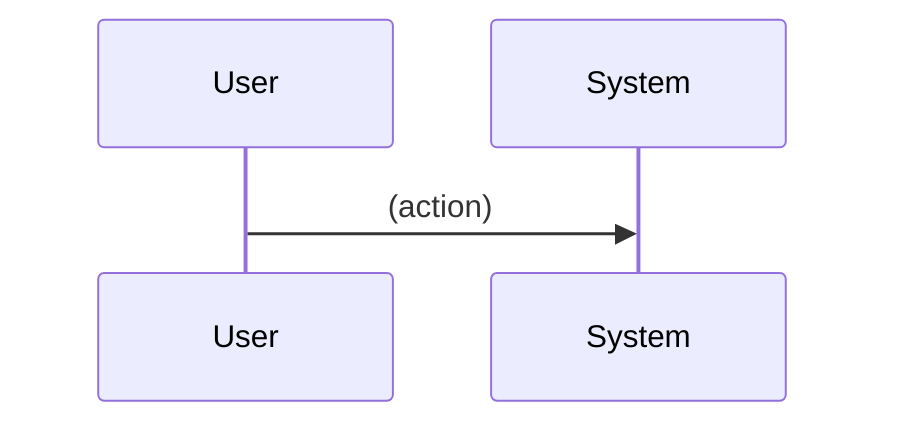

The arguments passed to this skill are the project name in kebab-case, followed by the feature name in kebab-case.

## Steps

1. Read the following for context:
   - `projects/{project-name}/features/{feature-name}/feature-brief.md` (required — do not proceed if missing)
   - `projects/{project-name}/architecture.md` (if it exists — this defines the project's actual system layers, e.g. Frontend/Backend/Database, or On-Device/Cloud for offline-first mobile apps)

2. Generate `projects/{project-name}/features/{feature-name}/technical-design.md` using the template below. Use the *actual* layer names for this project (from `architecture.md`) instead of the placeholders shown.

3. After writing the file, present the Review Checklist to the user.

---

## Output Template

```markdown
# Technical Design: {Feature Name}

> Status: Draft
> Created: {today's date}
> Project: {project-name}
> Feature ID: {feature-name}
> Depends on: feature-brief.md

## Approach Summary

Two to four sentences describing the overall technical approach.

## Design by Layer

For each system layer this feature touches (use this project's real layer names — repeat this subsection per layer):

### {Layer Name}

**Components involved:** Which modules/services in this layer are involved.

**Data flow:** How data moves through this layer for this feature. Use a numbered sequence if helpful.

**Storage:** What gets persisted in this layer, and the shape of that data (fields, types, relationships). Full schema detail comes in api-spec.md.

**Key algorithms or logic:** Any non-trivial logic that needs to run in this layer. Be specific — this will drive implementation tasks.

## Offline Behaviour & Sync Strategy

*Include this section only if the project has offline-capable clients or multi-device sync. Delete it otherwise.*

### What works offline
Describe exactly what the user can do and what the system does when there is no connectivity.

### Sync Strategy
When connectivity returns, how does this feature's data sync? Describe:
- What triggers sync
- What gets uploaded/downloaded
- Conflict handling (if applicable)
- Retry behaviour

## Sequence Diagrams

Use Mermaid sequence diagrams to illustrate the key flows.



Add one diagram per major flow (e.g. happy path, error path, sync path).

## Edge Cases

List edge cases that must be handled. For each, describe the expected system behaviour.

| Edge Case | Expected Behaviour |
|---|---|
| | |

## Open Questions

List any unresolved technical questions. Leave blank if none.

---

## Review Checklist

Before running the next skill, confirm:

- [ ] Every layer this feature touches has a complete, feasible design
- [ ] Offline behaviour is explicitly defined if applicable (nothing left as "TBD")
- [ ] Sync strategy is clear if applicable
- [ ] Edge cases are covered
- [ ] No open questions remain (or they are acceptable to carry forward)

**Next step:** When approved, run `/feature_api_spec {project-name} {feature-name}` if this feature has contracts to define, otherwise skip to `/feature_test_spec {project-name} {feature-name}`
```
